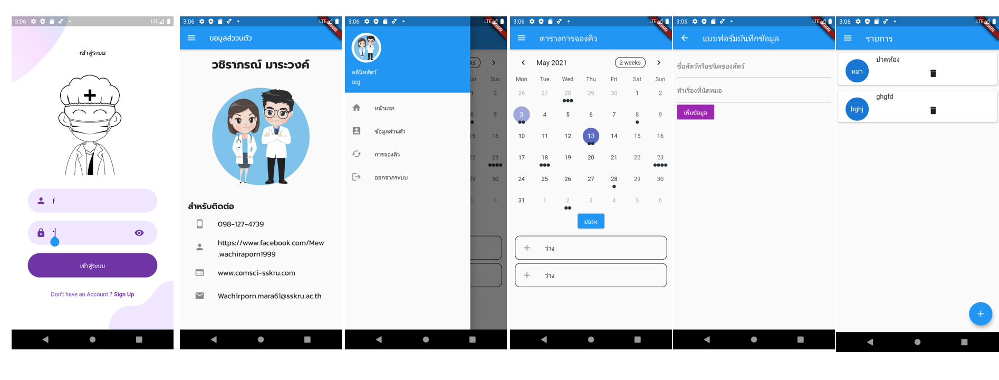

# SimpleToDoList

 พัฒนาโดย

นายธวัฒน์ ด้วงศรีเงิน

นายณัฐพล สมงาม

นางสาวจิราวรรณ บุญเล่ห์

นางสาวถนอมวรรณ ทิ้งเทพ

นางสาววชิราภรณ์ มาระวงค์

นางสาวสุพัตรา แสงสาย

สาขาวิทยาการคอมพิวเตอร์ คณะศิลปศาสตร์และวิทยาศาสตร์ มหาวิทยาลัยราชภัฏศรีสะเกษ

รายวิชา: การพัฒนาแอพพลิเคชั่นบนมือถือ

**Description:**

แอพพลิเคชั่นเกี่ยวกับ การจองคิวคลินิกสัตว์ เพื่อความสะดวกสบายต่อการจองคิว แอพสามารถจองคิวล่วงหน้าและดูตารางว่างของหมอได้

โมบายแอปพลิเคชั่นนี้พัฒนาขึ้นเพื่อใช้เป็นตัวอย่างในกรณีศึกษาการพัฒนาโมบายแอปพลิเคชั่นด้วย Flutter ในรายวิชาการพัฒนาแอพพลิเคชั่นบนมือถือ เพื่อให้ได้ใช้สำหรับการศึกษา ทดลองปฏิบัติตาม ให้เกิดความรู้ ความเข้าใจ และทักษะในการพัฒนาโปรแกรมบนมือถือด้วย Flutter

โปรแกรมแอพพลิเคชั่นเกี่ยวกับ การจองคิวคลินิกสัตว์ ประกอบด้วย 4 หน้า ได้แก่

## 1.หน้า LOGIN 

import 'package:flutter/material.dart';
import 'package:webviewDemo/Screens/Login/components/body.dart';

class LoginScreen extends StatelessWidget {
  @override
  Widget build(BuildContext context) {
    return Scaffold(
      body: Body(),
    );
  }
}

## 2.หน้า ตารางคิวว่าง
import 'dart:collection';

import 'package:flutter/material.dart';
import 'package:table_calendar/table_calendar.dart';
import 'package:webviewDemo/Screens/app/form_screen.dart';
import 'package:webviewDemo/drawer_menu.dart';

import '../utils.dart';

class StartPage extends StatefulWidget {
  @override
  _StartPageState createState() => _StartPageState();
}

class _StartPageState extends State<StartPage> {
  final ValueNotifier<List<Event>> _selectedEvents = ValueNotifier([]);

  // Using a `LinkedHashSet` is recommended due to equality comparison override
  final Set<DateTime> _selectedDays = LinkedHashSet<DateTime>(
    equals: isSameDay,
    hashCode: getHashCode,
  );

  CalendarFormat _calendarFormat = CalendarFormat.month;
  DateTime _focusedDay = DateTime.now();

  @override
  void dispose() {
    _selectedEvents.dispose();
    super.dispose();
  }

  List<Event> _getEventsForDay(DateTime day) {
    // Implementation example
    return kEvents[day] ?? [];
  }

  List<Event> _getEventsForDays(Set<DateTime> days) {
    // Implementation example
    // Note that days are in selection order (same applies to events)
    return [
      for (final d in days) ..._getEventsForDay(d),
    ];
  }

  void _onDaySelected(DateTime selectedDay, DateTime focusedDay) {
    setState(() {
      _focusedDay = focusedDay;
      // Update values in a Set
      if (_selectedDays.contains(selectedDay)) {
        _selectedDays.remove(selectedDay);
      } else {
        _selectedDays.add(selectedDay);
      }
    });

    _selectedEvents.value = _getEventsForDays(_selectedDays);
  }

  @override
  Widget build(BuildContext context) {
    return Scaffold(
      appBar: AppBar(
        title: Text('ตารางการจองคิว'),
      ),
      drawer: DrawerMenu(),
      body: Column(
        children: [
          TableCalendar<Event>(
            firstDay: kFirstDay,
            lastDay: kLastDay,
            focusedDay: _focusedDay,
            calendarFormat: _calendarFormat,
            eventLoader: _getEventsForDay,
            startingDayOfWeek: StartingDayOfWeek.monday,
            selectedDayPredicate: (day) {
              // Use values from Set to mark multiple days as selected
              return _selectedDays.contains(day);
            },
            onDaySelected: _onDaySelected,
            onFormatChanged: (format) {
              if (_calendarFormat != format) {
                setState(() {
                  _calendarFormat = format;
                });
              }
            },
            onPageChanged: (focusedDay) {
              _focusedDay = focusedDay;
            },
          ),
          ElevatedButton(
            child: Text('ย่อลง'),
            onPressed: () {
              setState(() {
                _selectedDays.clear();
                _selectedEvents.value = [];
              });
            },
          ),
          const SizedBox(height: 8.0),
          Expanded(
            child: ValueListenableBuilder<List<Event>>(
              valueListenable: _selectedEvents,
              builder: (context, value, _) {
                return ListView.builder(
                  itemCount: value.length,
                  itemBuilder: (context, index) {
                    return Container(
                      margin: const EdgeInsets.symmetric(
                        horizontal: 12.0,
                        vertical: 4.0,
                      ),
                      decoration: BoxDecoration(
                        border: Border.all(),
                        borderRadius: BorderRadius.circular(12.0),
                      ),
                      child: ListTile(
                        leading: Icon(Icons.add),
                        title: Text('ว่าง'),
                        onTap: () {
                          Navigator.push(
                            context,
                            MaterialPageRoute(
                                builder: (context) => FormScreen()),
                          );
                        },
                      ),
                    );
                  },
                );
              },
            ),
          ),
        ],
      ),
    );
  }
}

## 3.แบบฟอร์มบันทึกข้อมูล
import 'package:flutter/material.dart';
import 'package:webviewDemo/datadase/Transactions.dart';
import 'package:webviewDemo/providers/transaction_provider.dart';
import 'package:webviewDemo/Screens/app/home_screen.dart';
import 'package:provider/provider.dart';
import 'package:webviewDemo/form.dart';

class FormScreen extends StatelessWidget {
  final formKey = GlobalKey<FormState>();

  final titleController = TextEditingController();
  final dogController = TextEditingController();
  @override
  Widget build(BuildContext context) {
    return Scaffold(
        appBar: AppBar(
          title: Text("แบบฟอร์มบันทึกข้อมูล"),
        ),
        body: Padding(
          padding: const EdgeInsets.all(10.0),
          child: Form(
            key: formKey,
            child: Column(
              crossAxisAlignment: CrossAxisAlignment.start,
              children: [
                TextFormField(
                  decoration: new InputDecoration(
                      labelText: "ชื่อสัตว์หรือชนิดของสัตว์"),
                  autofocus: false,
                  controller: titleController,
                  validator: (String str) {
                    if (str.isEmpty) {
                      return "กรุณาป้อนชื่อสัตว์หรือชนิดสัตว์ของคุณ";
                    }
                    return null;
                  },
                ),
                TextFormField(
                  decoration:
                      new InputDecoration(labelText: "หัวเรื่องที่นัดหมอ"),
                  autofocus: false,
                  controller: dogController,
                  validator: (String str) {
                    if (str.isEmpty) {
                      return "กรุณาป้อนหัวเรื่อง";
                    }

                    return null;
                  },
                ),
                FlatButton(
                  child: Text("เพิ่มข้อมูล"),
                  color: Colors.purple,
                  textColor: Colors.white,
                  onPressed: () {
                    if (formKey.currentState.validate()) {
                      var title = titleController.text;
                      var dog = dogController.text;

                      Transactions statement = Transactions(
                          title: title, dog: dog, date: DateTime.now());

                      var provider = Provider.of<TransactionProvider>(context,
                          listen: false);
                      provider.addTransaction(statement);
                      Navigator.push(
                          context,
                          MaterialPageRoute(
                              fullscreenDialog: true,
                              builder: (context) {
                                return MyHomePage();
                              }));
                    }
                  },
                )
              ],
            ),
          ),
        ));
  }
}

## 4.รายการ

 import 'package:flutter/material.dart';
 import 'package:flutter/services.dart';
 import 'package:http/http.dart';
 import 'package:webviewDemo/datadase/Transactions.dart';
 import 'package:webviewDemo/drawer_menu.dart';
 import 'package:webviewDemo/providers/transaction_provider.dart';
 import 'package:intl/intl.dart';
 import 'package:provider/provider.dart';

 class HomeScreen extends StatefulWidget {
  @override
  _HomeScreenState createState() => _HomeScreenState();
}

 class _HomeScreenState extends State<HomeScreen> {
  @override
  void initState() {
    // TODO: implement initState
    super.initState();
    Provider.of<TransactionProvider>(context, listen: false).initData();
  }

  @override
  Widget build(BuildContext context) {
    return Scaffold(
        appBar: AppBar(
          title: Text("รายการ"),
          actions: [],
        ),
        drawer: DrawerMenu(),
        body: Consumer(
          builder: (context, TransactionProvider provider, Widget child) {
            var count = provider.transactions.length; //นับจำนวนข้อมูล
            if (count <= 0) {
              return Center(
                child: Text(
                  "ไม่พบข้อมูล",
                  style: TextStyle(fontSize: 35),
                ),
              );
            } else {
              return ListView.builder(
                  itemCount: count,
                  itemBuilder: (context, int index) {
                    Transactions data = provider.transactions[index];
                    return Card(
                      elevation: 3,
                      margin: const EdgeInsets.symmetric(
                          vertical: 7, horizontal: 5),
                      child: ListTile(
                        leading: CircleAvatar(
                          radius: 30,
                          child: FittedBox(
                            child: Text(data.title.toString()),
                          ),
                        ),
                        title: Text(data.dog),
                        subtitle: IconButton(
                          icon: const Icon(Icons.delete),
                          onPressed: () async {
                            final ConfirmAction action =
                                await _asyncConfirmDialog(context);
                            print("Confirm Action $action");
                          },
                        ),
                      ),
                    );
                  });
            }
          },
        ));
  }
}

 enum ConfirmAction { Cancel, Accept }
 Future<ConfirmAction> _asyncConfirmDialog(BuildContext context) async {
  return showDialog<ConfirmAction>(
    context: context,
    barrierDismissible: false, // user must tap button for close dialog!
    builder: (BuildContext context) {
      return AlertDialog(
        title: Text('ลบรายการ'),
        content: const Text('คุณต้องการลบจริงหรือไม่'),
        actions: <Widget>[
          FlatButton(
            child: const Text('ยกเลิก'),
            onPressed: () {
              Navigator.of(context).pop(ConfirmAction.Cancel);
            },
          ),
          FlatButton(
            child: const Text('ตกลง'),
            onPressed: () {
              Navigator.of(context).pop(ConfirmAction.Accept);
            },
          )
        ],
      );
    },
  );
}
## ตัวอย่างหน้าจอ

# appdoctor

